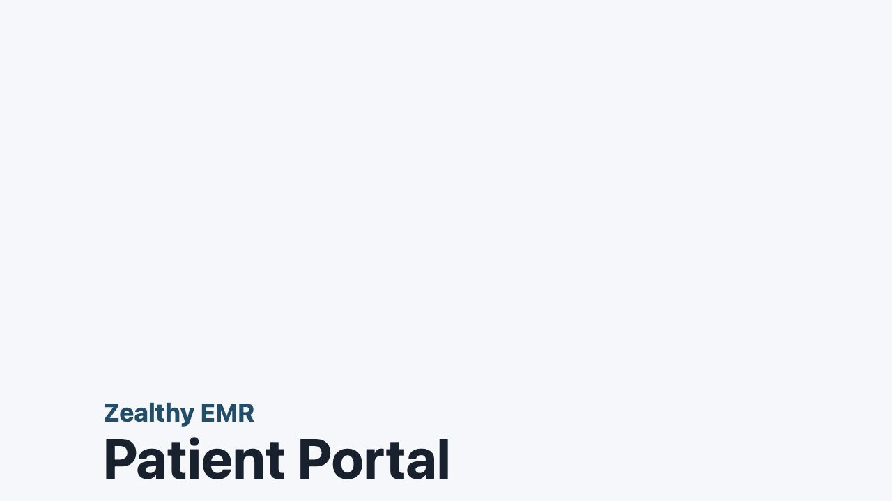
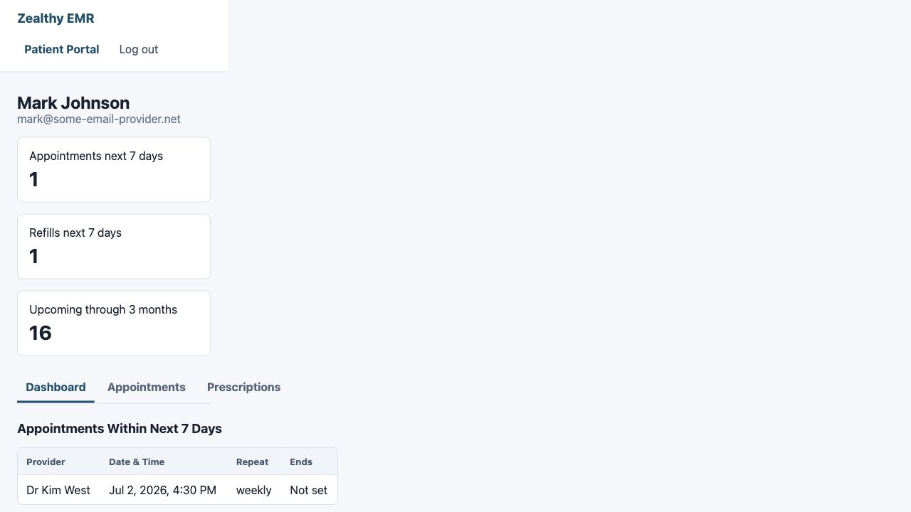
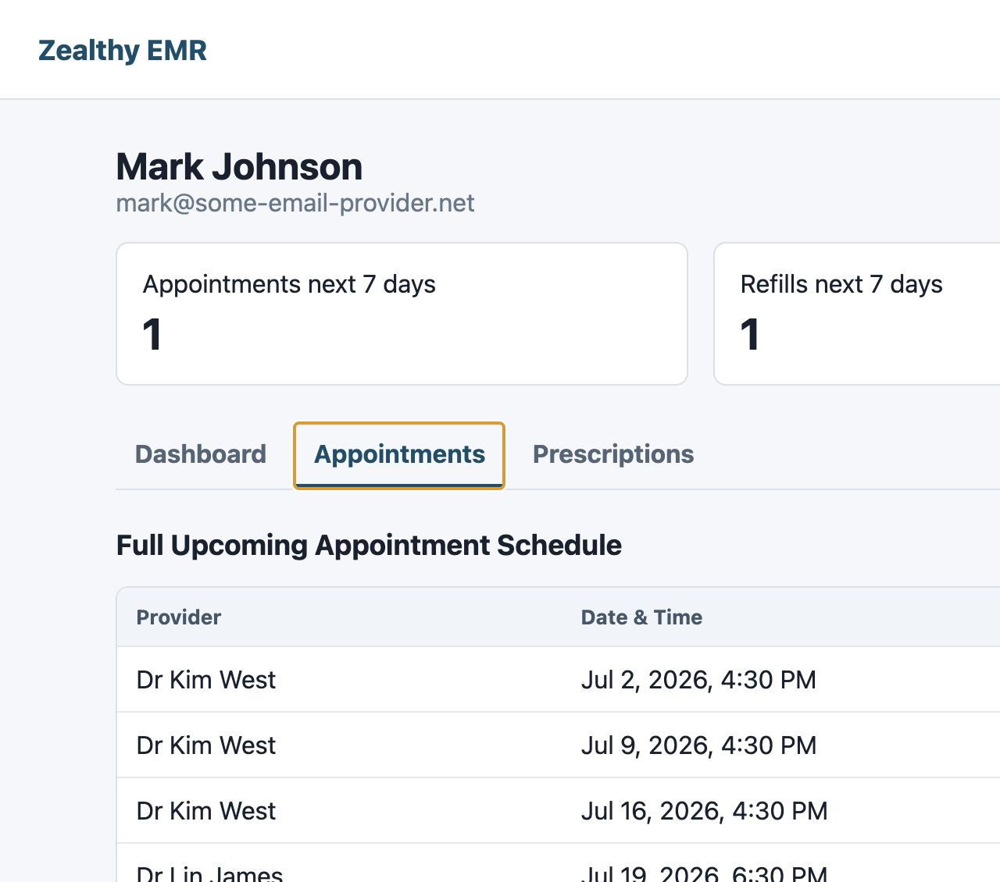
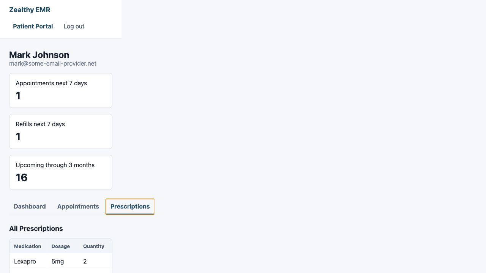
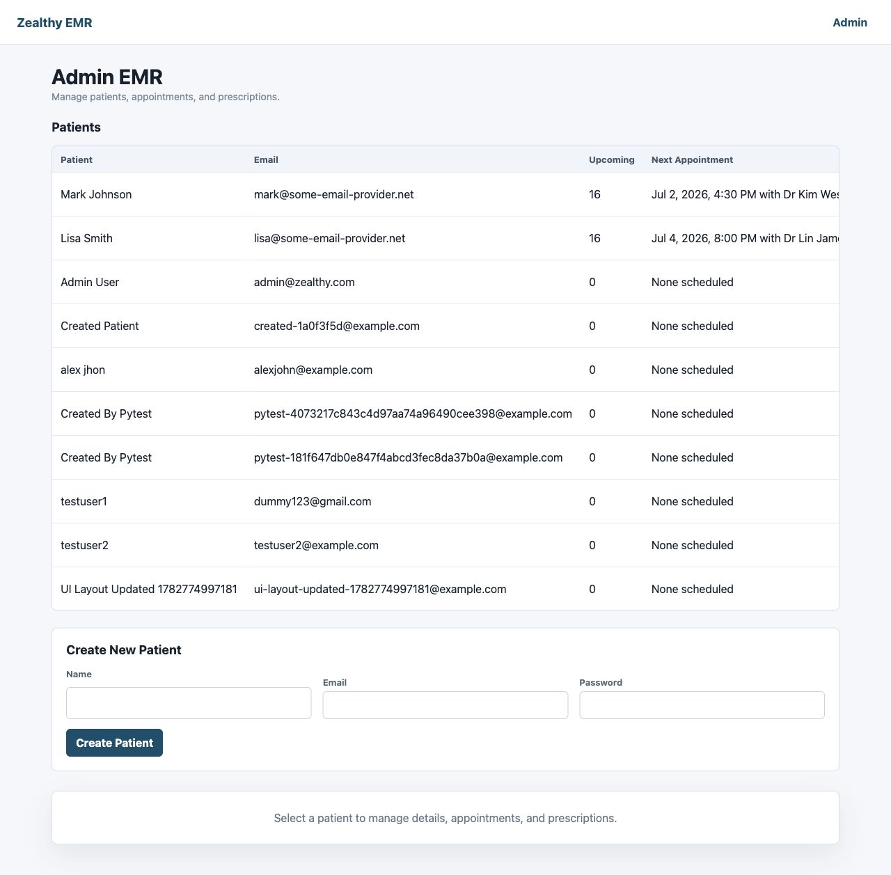
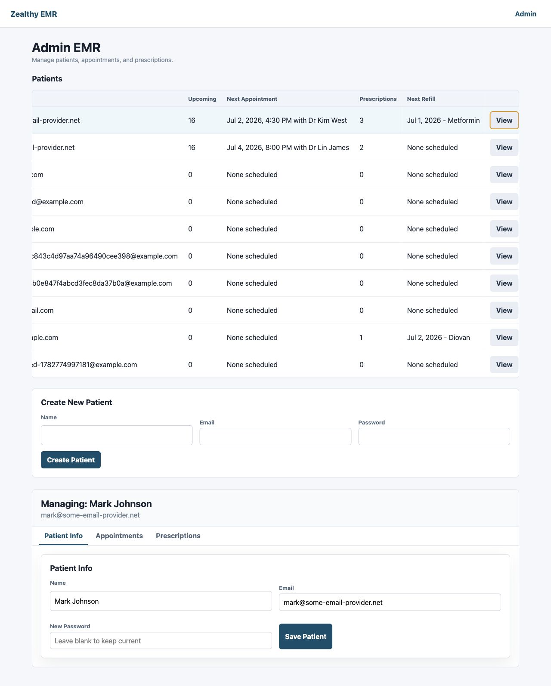
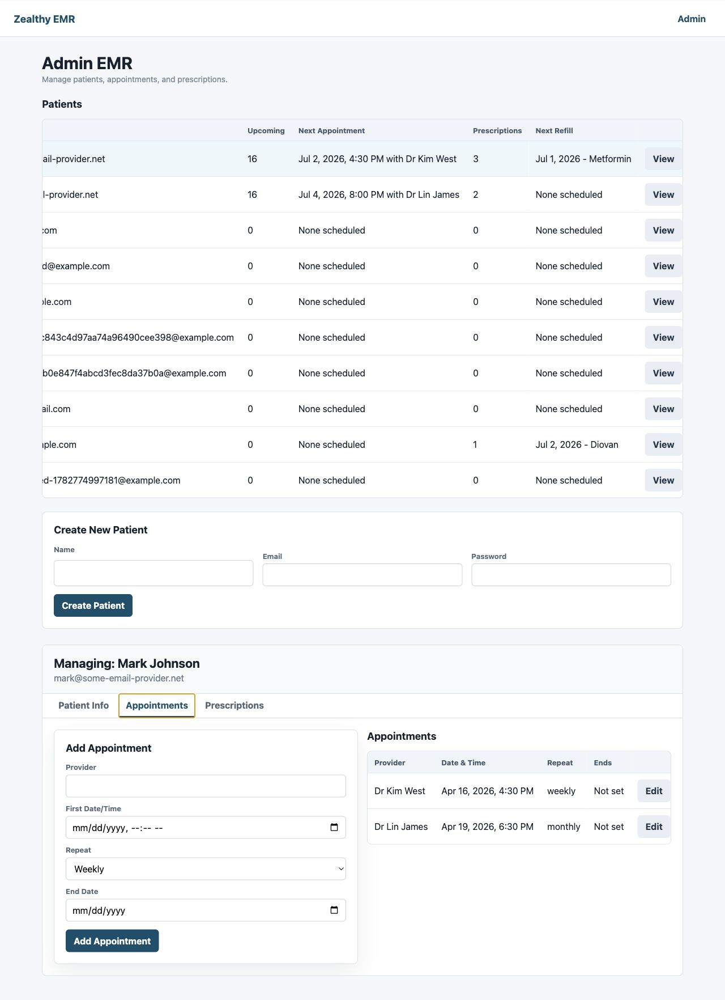
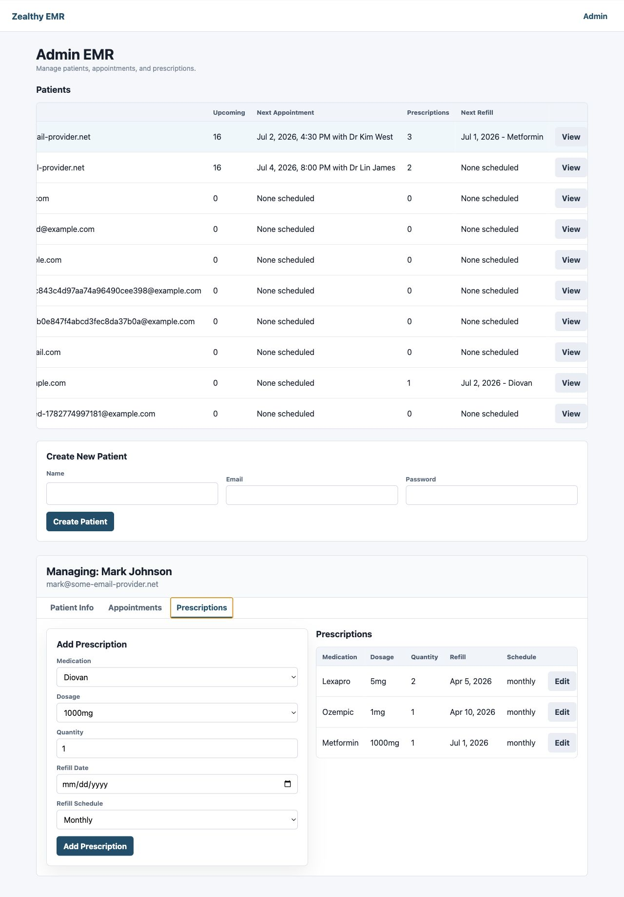
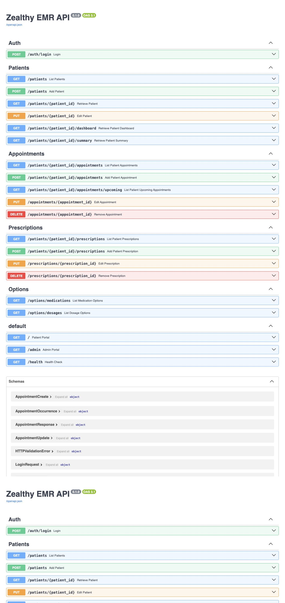
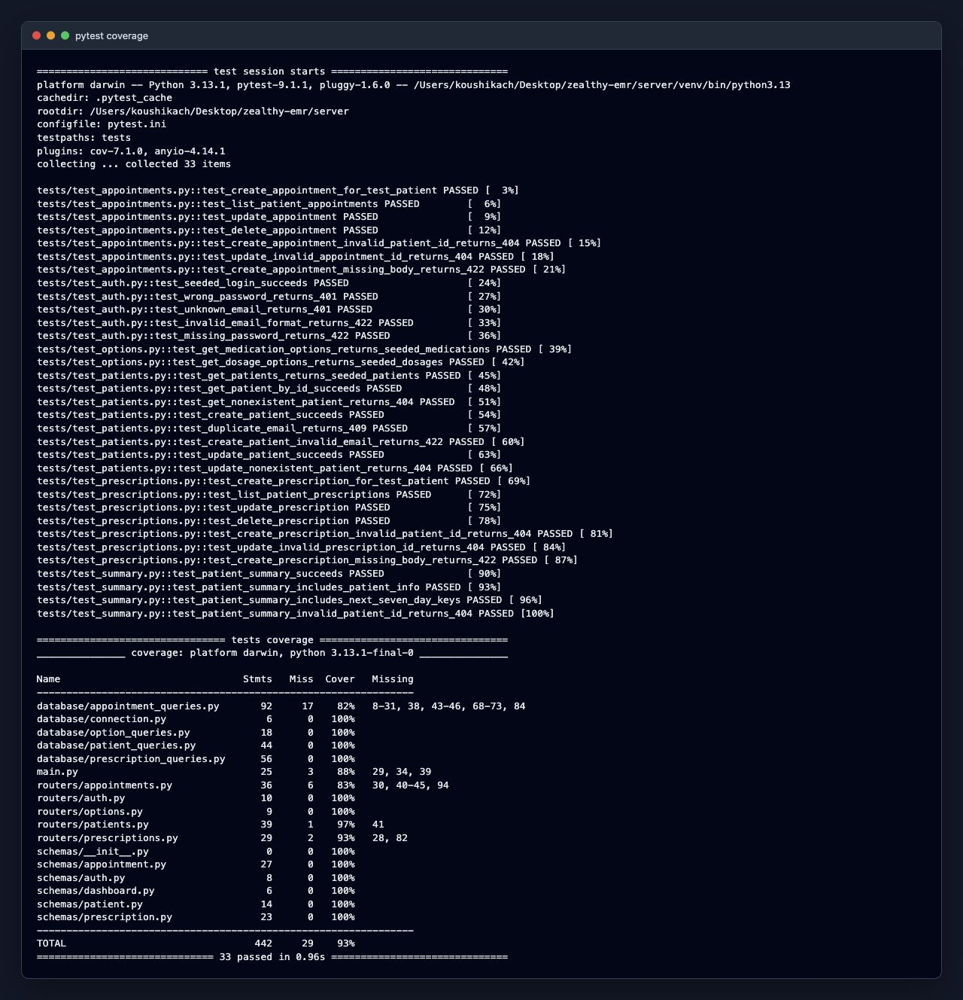

# Zealthy EMR Mini Electronic Medical Record System

## Overview

Zealthy EMR is a full-stack mini Electronic Medical Record system built for the Zealthy full-stack engineering exercise. It includes a React/Vite frontend, FastAPI backend, PostgreSQL database, an Admin EMR, and a Patient Portal.

Administrators can manage patients, appointments, and prescriptions. Patients can log in with seeded credentials or admin-created credentials to view dashboard summaries and drill down into appointments and prescriptions.

## Highlights

- React + Vite frontend
- FastAPI REST API
- PostgreSQL database
- Admin EMR and Patient Portal
- Patient, appointment, and prescription management
- 33 automated backend tests
- 93% backend code coverage

## Table of Contents

- [Features](#features)
- [Tech Stack](#tech-stack)
- [Architecture](#architecture)
- [Demo Credentials](#demo-credentials)
- [Folder Structure](#folder-structure)
- [Database Setup](#database-setup)
- [Backend Setup](#backend-setup)
- [Frontend Setup](#frontend-setup)
- [Running the Application](#running-the-application)
- [Running Tests](#running-tests)
- [API Endpoints](#api-endpoints)
- [Deployment](#deployment)
- [Security Considerations](#security-considerations)
- [Screenshots](#screenshots)
- [Future Improvements](#future-improvements)
- [Author](#author)

## Features

- Admin EMR at `/admin`
  - Patient table with at-a-glance appointment and prescription summary data
  - Patient create and update flows
  - Appointment create, read, update, and delete flows
  - Prescription create, read, update, and delete flows
  - Medication and dosage option lists seeded from JSON data
- Patient Portal at `/`
  - Patient login with seeded or admin-created credentials
  - Dashboard with patient info, next-7-day appointments, and next-7-day refills
  - Appointments tab with upcoming schedule through 3 months
  - Prescriptions tab with all prescriptions
- Backend API test suite with pytest and coverage

## Tech Stack

- Backend: Python, FastAPI, Pydantic, psycopg2, PostgreSQL
- Frontend: React, Vite, CSS
- Testing: pytest, pytest-cov, FastAPI TestClient

## Architecture

```text
React + Vite Frontend
↓
FastAPI Backend
↓
PostgreSQL Database
```

- `/` serves the Patient Portal.
- `/admin` serves the Admin EMR.
- `/docs` exposes Swagger API docs.

## Demo Credentials

Patient Portal seeded account:

```text
Email: mark@some-email-provider.net
Password: Password123!
```

Additional patients can be created from the Admin EMR and can immediately log into the Patient Portal using the credentials entered during creation.

Admin EMR:

```text
No authentication required for this take-home assignment.
Local URL: http://localhost:8001/admin
```

## Folder Structure

```text
.
├── client/
│   ├── src/
│   ├── index.html
│   ├── package.json
│   ├── package-lock.json
│   └── vite.config.js
├── database/
│   ├── schema.sql
│   ├── seed.py
│   └── seed.json
├── screenshots/
└── server/
    ├── config/
    ├── database/
    ├── routers/
    ├── schemas/
    ├── tests/
    ├── main.py
    ├── requirements.txt
    ├── pytest.ini
    └── .coveragerc
```

## Database Setup

Create a local PostgreSQL database, then apply the schema and seed data.

```bash
createdb zealthy_emr
psql zealthy_emr < database/schema.sql
python database/seed.py
```

The seed data includes sample patient credentials:

```text
mark@some-email-provider.net / Password123!
lisa@some-email-provider.net / Password123!
```

## Backend Setup

Create `server/.env`:

```env
DATABASE_NAME=zealthy_emr
DATABASE_USER=your_postgres_user
DATABASE_PASSWORD=
DATABASE_HOST=localhost
DATABASE_PORT=5432
```

Install dependencies:

```bash
cd server
python -m venv venv
source venv/bin/activate
pip install -r requirements.txt
```

## Frontend Setup

```bash
cd client
npm install
npm run build
```

The FastAPI app serves the built React files from `client/dist`.

## Running the Application

```bash
cd server
source venv/bin/activate
uvicorn main:app --reload --port 8001
```

Open:

- Patient Portal: `http://localhost:8001/`
- Admin EMR: `http://localhost:8001/admin`
- Swagger API docs: `http://localhost:8001/docs`
- API health check: `http://localhost:8001/health`

## Running Tests

```bash
cd server
pytest -v
pytest -v --cov=. --cov-report=term-missing
```

Current backend test status:

- 33 tests passing
- 93% backend coverage

## API Endpoints

### Auth

- `POST /auth/login`

### Patients

- `GET /patients`
- `GET /patients/{patient_id}`
- `POST /patients`
- `PUT /patients/{patient_id}`
- `GET /patients/{patient_id}/dashboard`
- `GET /patients/{patient_id}/summary`

### Appointments

- `GET /patients/{patient_id}/appointments`
- `GET /patients/{patient_id}/appointments/upcoming`
- `POST /patients/{patient_id}/appointments`
- `PUT /appointments/{appointment_id}`
- `DELETE /appointments/{appointment_id}`

### Prescriptions

- `GET /patients/{patient_id}/prescriptions`
- `POST /patients/{patient_id}/prescriptions`
- `PUT /prescriptions/{prescription_id}`
- `DELETE /prescriptions/{prescription_id}`

### Options

- `GET /options/medications`
- `GET /options/dosages`

## Deployment

Recommended deployment shape:

1. Provision a PostgreSQL database.
2. Configure backend environment variables for the deployed database.
3. Build the React frontend with `npm run build`.
4. Deploy the FastAPI server so it serves both API routes and the React build.
5. Run schema and seed setup against the production database.

Potential hosts include Render, Railway, Fly.io, Heroku, AWS, or Azure.

Demo URLs:

- GitHub repository: _pending_
- Live demo: _pending_

## Security Considerations

Security was intentionally kept minimal for this take-home assignment so the required EMR workflows could be completed clearly and reviewed quickly.

- Plain-text passwords are used for demonstration only.
- `/admin` does not require authentication, matching the assignment prompt.
- JWT/session auth is not implemented.
- RBAC is not implemented.
- In production, passwords should be hashed with bcrypt, admin routes should require authentication, RBAC should be added, HTTPS should be enforced, and audit logging should be added.

## Screenshots

### 1. Patient Login

> **Description**
>
> Patient login screen where seeded or admin-created patients authenticate using their email and password.



---

### 2. Patient Dashboard

> **Description**
>
> Patient dashboard showing basic patient information, appointments in the next 7 days, and medication refills in the next 7 days.



---

### 3. Patient Appointments

> **Description**
>
> Patient Portal Appointments tab showing the full upcoming appointment schedule up to 3 months.



---

### 4. Patient Prescriptions

> **Description**
>
> Patient Portal Prescriptions tab showing all prescriptions for the logged-in patient.



---

### 5. Admin Dashboard

> **Description**
>
> Admin EMR dashboard showing the patient table with at-a-glance appointment and prescription data.



---

### 6. Patient Management

> **Description**
>
> Admin selected-patient workspace showing the Patient Info tab and update patient form.



---

### 7. Appointment Management

> **Description**
>
> Admin selected-patient Appointments tab showing appointment list and create, edit, and delete controls.



---

### 8. Prescription Management

> **Description**
>
> Admin selected-patient Prescriptions tab showing prescription list and create, edit, and delete controls.



---

### 9. FastAPI Swagger API Docs

> **Description**
>
> FastAPI Swagger documentation at `/docs` showing the available backend API endpoints.



---

### 10. Backend Test Suite / Coverage

> **Description**
>
> Terminal output showing pytest coverage with 33 passing tests and 93% backend coverage.



## Future Improvements

- bcrypt password hashing
- JWT authentication
- RBAC for admin
- audit logging
- HTTPS
- CI/CD
- cloud deployment
- Docker
- pagination/filtering

## Author

Koushikach
